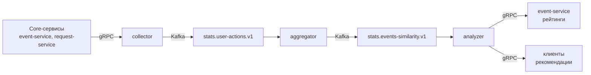

# 🚀 Explore With Me — Микросервисная платформа для организации мероприятий

[](https://adoptium.net/)
[](https://spring.io/projects/spring-boot)
[](https://spring.io/projects/spring-cloud)
[](https://kafka.apache.org/)
[](https://www.postgresql.org/)
[](https://www.docker.com/)

**Explore With Me** — платформа, помогающая пользователям организовывать досуг: публиковать анонсы интересных мероприятий, управлять заявками на участие, оставлять комментарии и находить компанию для совместного посещения событий.

В рамках дипломного проекта монолитное приложение было переработано в высоконагруженную микросервисную систему с использованием **Spring Cloud**, **Apache Kafka** и **gRPC**. Основная цель — повысить отказоустойчивость, обеспечить независимое масштабирование сервисов и внедрить персонализированные рекомендации на основе поведения пользователей.

---

## 📑 Оглавление

- [Архитектура и структура модулей](#-архитектура-и-структура-модулей)
    - [Инфраструктурный слой](#-инфраструктурный-слой-infra)
    - [Слой бизнес-логики](#-слой-бизнес-логики-core)
    - [Сервис статистики и рекомендаций](#-сервис-статистики-и-рекомендаций-stats-service)
    - [Рекомендательная система](#-рекомендательная-система-на-базе-apache-kafka)
- [Поток данных](#-поток-данных)
- [Алгоритм рекомендаций](#-алгоритм-рекомендаций)
- [Внутренние API](#-внутренние-api)
    - [REST (OpenFeign)](#rest-openfeign--взаимодействие-между-core-сервисами)
    - [gRPC](#grpc--рекомендательная-система)
- [Внешнее API](#-внешнее-api)
- [Отказоустойчивость и надёжность](#-отказоустойчивость-и-надёжность)
- [Порядок локального запуска](#-порядок-локального-запуска)
- [Используемые технологии](#-используемые-технологии)
- [Структура репозитория](#-структура-репозитория-схематично)

---

## 🏗️ Архитектура и структура модулей

Проект разделён на изолированные модули, сгруппированные по функциональному назначению:

### ⚙️ Инфраструктурный слой (`infra`)

Служебные сервисы для обеспечения работы распределённой системы:

| Сервис | Назначение |
| :--- | :--- |
| **discovery-server** (Eureka) | Центральный реестр, в котором динамически регистрируются все микросервисы для последующего обнаружения. |
| **config-server** | Единый центр управления конфигурациями (`.properties` / `.yml`), сервисы запрашивают настройки при старте. |
| **gateway-server** | Единая точка входа для внешних клиентов (порт `8080`), маршрутизация запросов к соответствующим сервисам. |

### 💼 Слой бизнес-логики (`core`)

Каждая бизнес-сущность вынесена в отдельный автономный микросервис со своей базой данных и зоной ответственности:

| Сервис | Назначение |
| :--- | :--- |
| **user-service** | Администрирование пользователей и управление профилями. |
| **event-service** | Ядро управления событиями: создание, модерация, публикация, обновление и поиск. |
| **category-service** | Ведение и категоризация типов мероприятий. |
| **request-service** | Обработка и модерация заявок на участие в событиях. |
| **compilation-service** | Управление тематическими подборками событий. |
| **comment-service** | Изолированный функционал для публикации и модерации комментариев. |
| **common** | Общий модуль с разделяемыми DTO, кастомными исключениями и глобальным обработчиком ошибок (`ErrorHandler`). |

### 📊 Сервис статистики и рекомендаций (`stats-service`)

Модуль объединяет сбор аналитики и построение рекомендаций на основе поведения пользователей:

| Модуль | Назначение |
| :--- | :--- |
| **stats-server** | REST API для сбора и получения статистики просмотров событий. |
| **stats-client** | Клиентский модуль (REST + gRPC) для отправки действий и запросов рекомендаций. |
| **stats-dto** | Общие DTO для статистики. |
| **stats-proto** | Protobuf-схемы gRPC-сервисов (Collector, Analyzer). |
| **stats-avro** | Avro-схемы для сообщений Kafka. |

### 🧠 Рекомендательная система (на базе Apache Kafka)

Три микросервиса, реализующих обработку событий пользователей и построение персонализированных рекомендаций в реальном времени:

| Сервис | Назначение |
| :--- | :--- |
| **collector** | Принимает gRPC-сообщения о действиях пользователей (просмотр, регистрация, лайк), сериализует их в Avro и отправляет в Kafka-топик `stats.user-actions.v1`. |
| **aggregator** | Читает действия из Kafka, вычисляет косинусное сходство между мероприятиями (инкрементально) и отправляет результаты в топик `stats.events-similarity.v1`. |
| **analyzer** | Потребляет оба топика, сохраняет данные в PostgreSQL (таблицы `user_actions`, `event_similarities`), предоставляет gRPC API для выдачи рекомендаций. |

---

## 🔄 Поток данных



### 🧮 Алгоритм рекомендаций

**Косинусное сходство между событиями A и B:**

$$
\text{similarity}(A, B) = \frac{S_{\min}(A, B)}{\sqrt{S_A \cdot S_B}}
$$

где:
- `S_A`, `S_B` — суммы максимальных весов всех пользователей для событий A и B;
- `S_min(A, B)` — сумма минимальных весов для пользователей, взаимодействовавших с обоими событиями.

**Веса действий пользователя:**

| Действие | Вес |
| :--- | :--- |
| `VIEW` (просмотр) | 0.4 |
| `REGISTER` (заявка) | 0.8 |
| `LIKE` (лайк) | 1.0 |

**Инкрементальное обновление:**  
При поступлении нового действия с весом, превышающим предыдущий максимум для пары (пользователь, событие), обновляются частные суммы `S_A`, `S_B` и `S_min(A, B)` для всех пар, что позволяет избежать полного пересчёта.

**Выдача рекомендаций пользователю:**

1. Выбираются последние N событий, с которыми пользователь взаимодействовал.
2. Для каждого из них находятся похожие события (исключая уже просмотренные).
3. Для каждого кандидата вычисляется предсказанная оценка как взвешенное среднее оценок ближайших соседей.
4. Возвращаются `max_results` событий с наивысшей оценкой.

---

## 🔌 Внутренние API

### REST (OpenFeign) — взаимодействие между core-сервисами

<details>
<summary><b>🔍 Основные точки интеграции через Feign-клиенты</b></summary>

- **event-service → category-service:** `GET /internal/categories/{catId}` — получить категорию.
- **event-service → user-service:** `GET /internal/users/{userId}` и `GET /internal/users/{userId}/exists`.
- **event-service → request-service:**
    - `GET /internal/requests/event/{eventId}?userId={userId}` — список заявок;
    - `PATCH /internal/requests/event/{eventId}/status` — обновить статусы;
    - `GET /internal/requests/event/{eventId}/count?status={status}` — количество заявок.
- **Другие сервисы → event-service (InternalEventController):**
    - проверка существования, статуса публикации, инициатора, лимита участников, модерации;
    - получение краткого DTO события.
- **Другие сервисы → category-service (InternalCategoryController):** получение категории.
- **Другие сервисы → user-service (InternalUserController):** проверка существования, получение имени, получение пользователя.
- **Другие сервисы → request-service (InternalRequestController):** получение заявок, обновление статусов, подсчёт по статусу.

</details>

### gRPC — рекомендательная система

| Сервис | Метод | Вход | Выход (поток) |
| :--- | :--- | :--- | :--- |
| **Collector** | `CollectUserAction` | `UserActionProto` (user_id, event_id, action_type, timestamp) | `Empty` |
| **Analyzer** | `GetRecommendationsForUser` | `UserPredictionsRequestProto` (user_id, max_results) | `RecommendedEventProto` (event_id, score — предсказанная оценка) |
| **Analyzer** | `GetSimilarEvents` | `SimilarEventsRequestProto` (event_id, user_id, max_results) | `RecommendedEventProto` (event_id, score — коэффициент сходства) |
| **Analyzer** | `GetInteractionsCount` | `InteractionsCountRequestProto` (event_id — список) | `RecommendedEventProto` (event_id, score — сумма весов) |

---

## 🌐 Внешнее API

Проект реализует публичный и административный API в соответствии со спецификацией Yandex Practicum:

- Основной сервис (event-service): [`ewm-main-service-spec.json`](link/to/spec)
- Сервис статистики (stats-service): [`ewm-stats-service-spec.json`](link/to/spec)

**Дополнительные эндпоинты (рекомендации):**

| Метод | Эндпоинт | Назначение |
| :--- | :--- | :--- |
| `GET` | `/events/recommendations` | Получить персонализированные рекомендации (заголовок `X-EWM-USER-ID`). |
| `PUT` | `/events/{eventId}/like` | Поставить лайк мероприятию (заголовок `X-EWM-USER-ID`). Только для посещённых событий. |

---

## 🛡️ Отказоустойчивость и надёжность

- **Resilience4j** — паттерны Circuit Breaker и Retry для всех Feign-клиентов.
- **Fallback-методы** — при недоступности целевого сервиса возвращаются безопасные значения по умолчанию (например, `false`, `0`, `null`).
- **Eureka** — динамическое обнаружение сервисов, автоматическая перерегистрация.
- **Обработка ошибок gRPC:** все вызовы `CollectorClient` и `AnalyzerClient` обёрнуты в `try-catch` с логированием, чтобы сбои рекомендательной системы не влияли на основную бизнес-логику.

**Базовые параметры отказоустойчивости в Config Server:**

```properties
resilience4j.circuitbreaker.configs.default.sliding-window-size=10
resilience4j.circuitbreaker.configs.default.failure-rate-threshold=50
resilience4j.circuitbreaker.configs.default.wait-duration-in-open-state=10s
resilience4j.retry.configs.default.max-attempts=3
resilience4j.retry.configs.default.wait-duration=1s
resilience4j.timelimiter.configs.default.timeout-duration=5s
```

## 🚦 Порядок локального запуска

1. **Запустить инфраструктуру** (PostgreSQL, Zookeeper, Kafka, Schema Registry, инициализация топиков):
   ```bash
   docker-compose up -d
    ```
2. **discovery-server (Eureka)** ` порт 8761 `
3. **config-server** ` порт 8888 `
4. **Микросервисы** (в любом порядке, все регистрируются в Eureka и получают конфигурации):
- `stats-server`
- `event-service`
- `category-service`
- `user-service`
- `request-service`
- `compilation-service`
- `comment-service`
- `collector`
- `aggregator`
- `analyzer`
5. **gateway-server** — ` порт 8080 `, единая точка входа для всех клиентских запросов.

## 🛠️ Используемые технологии

| Технология | Назначение |
| :--- | :--- |
| **Java 21** | Язык программирования |
| **Spring Boot 3, Spring Cloud** | Микросервисный фреймворк, Gateway, Config, Netflix Eureka |
| **Spring Data JPA (Hibernate)** | ORM для работы с базами данных |
| **PostgreSQL** | Реляционная база данных |
| **Apache Kafka + Schema Registry (Confluent)** | Потоковая обработка данных, сериализация Avro |
| **gRPC (gRPC Spring Boot Starter)** | Высокопроизводительный RPC-фреймворк |
| **Avro** | Сериализация данных для Kafka |
| **Resilience4j** | Отказоустойчивость (Circuit Breaker, Retry) |
| **OpenFeign** | Синхронное HTTP-взаимодействие между сервисами |
| **Docker и Docker Compose** | Контейнеризация и оркестрация |

---

## 📦 Структура репозитория (схематично)
```
├── core/                     # Бизнес-микросервисы
│   ├── event-service/
│   ├── category-service/
│   ├── user-service/
│   ├── request-service/
│   ├── compilation-service/
│   ├── comment-service/
│   └── common/
├── infra/                    # Инфраструктурные сервисы
│   ├── discovery-server/
│   ├── config-server/
│   └── gateway-server/
├── stats-service/            # Сервис статистики и рекомендаций
│   ├── server/
│   ├── client/
│   ├── dto/
│   ├── proto/
│   ├── avro/
│   ├── collector/
│   ├── aggregator/
│   └── analyzer/
├── docker-compose.yml
└── README.md
```